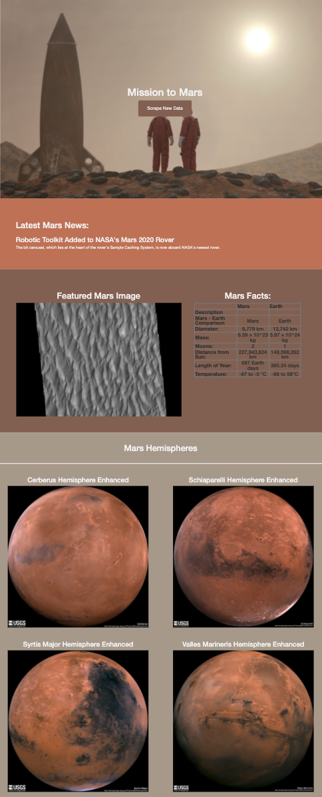

# Mission-to-Mars

## Overview of Analysis

The purpose of this project is to build a web application to gather information from NASA's MArs News website and display it on a central location. 

## Results

The data preparation utilizes the following steps to create the web application:

**1. Scrape the Data**

BeautifulSoup and Splinter was utilized to visit the NASA Mars news site to scrape the data. In this specific project, we were able to scrape full resolution images of Mar's hemispheres and titles. Insights for the data scraping process are located on the <a href="Mission_to_Mars_Challenge.ipynb">Mission To Mars Report</a>. 

**2. Creating Database**

Python and HTML was used to create a <a href="scraping.py">Scraping Python File</a>, update the <a href="app.py">Mongo App Database</a> and modify the <a href="templates/index.html">HTML Index File</a>. 

**3. Web Application**

<a href="templates/index.html">HTML</a> and <a href="static/styles.css">CSS</a> was used to update our web application to make it mobile-responsive and to ensure it was easy to read and user-friendly.

### Web Application

The web application will display 4 items:

1. A Header and a Button to Scrape New Data
2. The Latest Mars News
3. The Featured Mars Image
4. Mars Facts
5. Mars Hemispheres Titles and Images

Here is an example of the web appliaction: 

